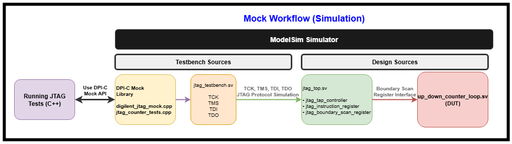
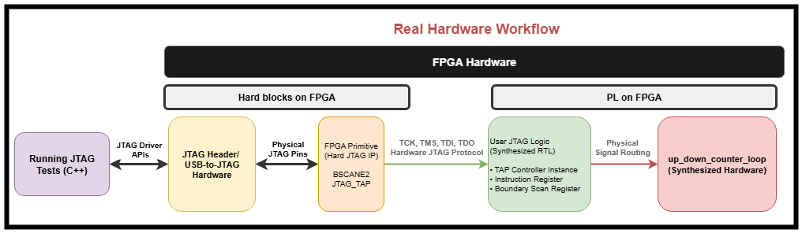
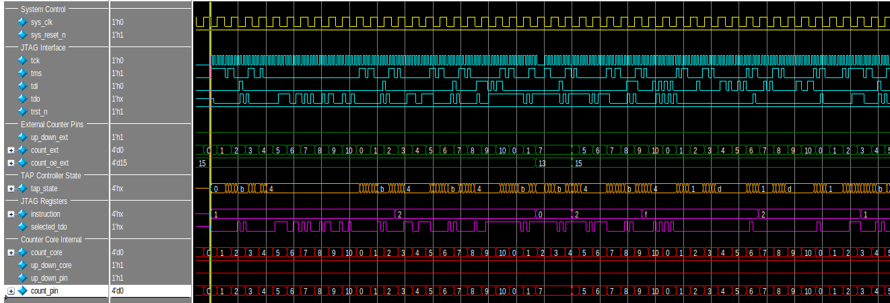

# JTAG Mock Implementation Project

## Project Description

This project implements a JTAG (IEEE 1149.1) boundary scan mock system that **eliminates external hardware dependencies** while maintaining full API compatibility with real hardware workflows. The key innovation is providing a software-based testing environment that uses the **exact same Digilent JTAG APIs** as production systems.

### Mock Workflow (Primary Focus)


The mock workflow replaces physical hardware with simulation:
- **C++ Test Application** → **DPI-C Mock Library** → **SystemVerilog Testbench** → **RTL Design**
- **Same Digilent API calls** (`djtg_enable()`, `djtg_put_tms_tdi_bits()`, etc.) as real hardware
- Software mock intercepts API calls and drives RTL simulation via DPI-C
- No USB adapters, FPGA boards, or physical connections required

### Real Hardware Workflow  


Traditional approach requiring physical components:
- **C++ Test Application** → **Digilent APIs** → **USB-to-JTAG Hardware** → **FPGA** → **Synthesized RTL**
- Same API calls but routed through actual Digilent drivers to physical hardware
- Requires hardware setup, power, cables, and device availability

Both workflows test identical JTAG functionality, ensuring the mock accurately represents real hardware behavior.

### Counter DUT Integration
The project demonstrates mock effectiveness using a simple **up_down_counter_loop** as the device under test:
- 4-bit counter that increments/decrements based on `up_down` control signal
- Boundary scan register controls counter direction via JTAG EXTEST instruction
- Simple enough to verify correct mock behavior, complex enough to validate JTAG protocol
- Proves the mock can test real design functionality through boundary scan interface

**Key Benefit:** Test the JTAG boundary scan logic using familiar Digilent APIs without any physical hardware dependencies.

## DPI-C Involvement

DPI-C (Direct Programming Interface) enables seamless communication between C++ and SystemVerilog:

**Export Functions (SystemVerilog → C++):**
- `sv_drive_jtag_pins()` - Drive JTAG signals (TCK, TMS, TDI)
- `sv_get_tdo()` - Read TDO response
- `sv_wait_cycles()` - Timing control
- `sv_jtag_step()` - Complete JTAG transaction

**Import Functions (C++ → SystemVerilog):**
- `run_counter_jtag_tests()` - Main test entry point

This interface allows C++ test code to directly control and monitor the RTL simulation, providing hardware-accurate testing without physical device.

## Folder Structure

```
src/
├── dpi/                          # DPI-C C++ source files
├── rtl/                          # SystemVerilog RTL design files  
├── tb/                           # SystemVerilog testbench files
├── Makefile                      # Build and simulation script
├── dpi_header.h                  # Generated DPI header
└── run_sim                       # Simulation execution script
```

## Execution Steps
Refer to [Codebase Overview document](./src/README.md) for more details on this.

## Results

### Test Coverage
The implementation validates the following JTAG functionality:

**Tests:**
- IDCODE (0x1) - Device identification retrieval
- SAMPLE (0x2) - Pin state capture  
- EXTEST (0x0) - External pin control
- BYPASS (0xF) - Minimal delay path
- Unknown instruction handling

### Output Example
```
=== JTAG Counter Tests Started ===
IDCODE Test: PASSED - Device ID: 0x12345678
SAMPLE Test: PASSED - Pin states captured
EXTEST Test: PASSED - Counter controlled via boundary scan  
BYPASS Test: PASSED - 1-bit delay verified
Complex Sequence Test: PASSED - Multiple instruction flow
=== All Tests PASSED ===
```


The waveform from ModelSim execution illustrates the signal transitions on the TCK, TDI, TMS, TDO signals and the state transition of the JTAG TAP controller FSM among others.

This mock implementation provides comprehensive JTAG testing capabilities while maintaining full compatibility with real hardware workflows.

### Resources
1. [DJTG Programmer's Reference Manual from Digilent](./docs/DJTG%20Programmers%20Reference%20Manual%20-%20Digilent.pdf)
2. [1149.1-2013 - IEEE Standard for Test Access Port and Boundary-Scan Architecture](https://ieeexplore.ieee.org/document/6515989)
3. [SystemVerilog DPI-C Tutorial from Doulos](https://www.doulos.com/knowhow/systemverilog/systemverilog-tutorials/systemverilog-dpi-tutorial/)